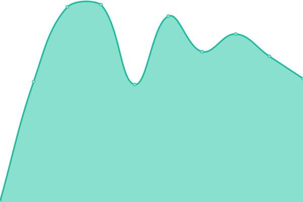
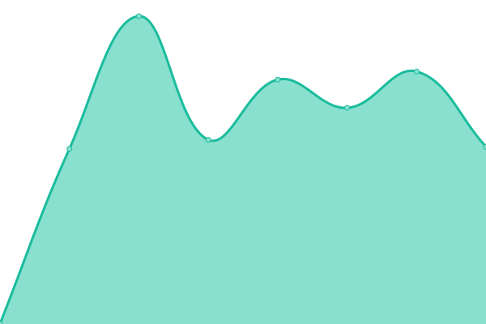
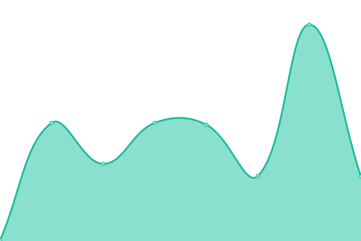

# [📈 Live Status](https://status.eyenx.ch): <!--live status--> **🟩 All systems operational**

This repository contains the open-source uptime monitor and status page for [Toni Tauro](https://eyenx.ch), powered by [Upptime](https://github.com/upptime/upptime).

With [Upptime](https://upptime.js.org), you can get your own unlimited and free uptime monitor and status page, powered entirely by a GitHub repository. We use [Issues](https://github.com/eyenx/upptime/issues) as incident reports, [Actions](https://github.com/eyenx/upptime/actions) as uptime monitors, and [Pages](https://status.eyenx.ch) for the status page.

<!--start: status pages-->
<!-- This summary is generated by Upptime (https://github.com/upptime/upptime) -->
<!-- Do not edit this manually, your changes will be overwritten -->
<!-- prettier-ignore -->
| URL | Status | History | Response Time | Uptime |
| --- | ------ | ------- | ------------- | ------ |
|  [Blog](https://eyenx.ch) | 🟩 Up | [blog.yml](https://github.com/eyenx/upptime/commits/HEAD/history/blog.yml) | 

 588ms
     
 | 

<a href="https://status.eyenx.ch/history/blog">97.89%</a>
    

|  [pub.eyenx.ch](https://pub.eyenx.ch) | 🟩 Up | [pub-eyenx-ch.yml](https://github.com/eyenx/upptime/commits/HEAD/history/pub-eyenx-ch.yml) | 

 772ms
     
 | 

<a href="https://status.eyenx.ch/history/pub-eyenx-ch">100.00%</a>
    

|  NextCloud | 🟩 Up | [next-cloud.yml](https://github.com/eyenx/upptime/commits/HEAD/history/next-cloud.yml) | 

 1199ms
     
 | 

<a href="https://status.eyenx.ch/history/next-cloud">100.00%</a>
    

|  Git | 🟩 Up | [git.yml](https://github.com/eyenx/upptime/commits/HEAD/history/git.yml) | 

 629ms
     
 | 

<a href="https://status.eyenx.ch/history/git">100.00%</a>
    

|  Private CI | 🟩 Up | [private-ci.yml](https://github.com/eyenx/upptime/commits/HEAD/history/private-ci.yml) | 

 637ms
     
 | 

<a href="https://status.eyenx.ch/history/private-ci">97.89%</a>
    

|  Mail | 🟩 Up | [mail.yml](https://github.com/eyenx/upptime/commits/HEAD/history/mail.yml) | 

 661ms
     
 | 

<a href="https://status.eyenx.ch/history/mail">97.89%</a>
    

|  Container Registry | 🟩 Up | [container-registry.yml](https://github.com/eyenx/upptime/commits/HEAD/history/container-registry.yml) | 

 652ms
     
 | 

<a href="https://status.eyenx.ch/history/container-registry">100.00%</a>
    

|  Matrix | 🟩 Up | [matrix.yml](https://github.com/eyenx/upptime/commits/HEAD/history/matrix.yml) | 

 674ms
     
 | 

<a href="https://status.eyenx.ch/history/matrix">97.89%</a>
    

|  Wallabag | 🟩 Up | [wallabag.yml](https://github.com/eyenx/upptime/commits/HEAD/history/wallabag.yml) | 

 852ms
     
 | 

<a href="https://status.eyenx.ch/history/wallabag">100.00%</a>
    

|  Immich | 🟩 Up | [immich.yml](https://github.com/eyenx/upptime/commits/HEAD/history/immich.yml) | 

 773ms
     
 | 

<a href="https://status.eyenx.ch/history/immich">100.00%</a>
    

|  Jellyfin | 🟩 Up | [jellyfin.yml](https://github.com/eyenx/upptime/commits/HEAD/history/jellyfin.yml) | 

 981ms
     
 | 

<a href="https://status.eyenx.ch/history/jellyfin">100.00%</a>
    

|  [upptime](https://status.eyenx.ch) | 🟩 Up | [upptime.yml](https://github.com/eyenx/upptime/commits/HEAD/history/upptime.yml) | 

 129ms
     
 | 

<a href="https://status.eyenx.ch/history/upptime">100.00%</a>
    

<!--end: status pages-->

[**Visit our status website →**](https://status.eyenx.ch)

## 📄 License

- Powered by: [Upptime](https://github.com/upptime/upptime)
- Code: [MIT](./LICENSE) © [Toni Tauro](https://eyenx.ch)
- Data in the `./history` directory: [Open Database License](https://opendatacommons.org/licenses/odbl/1-0/)
